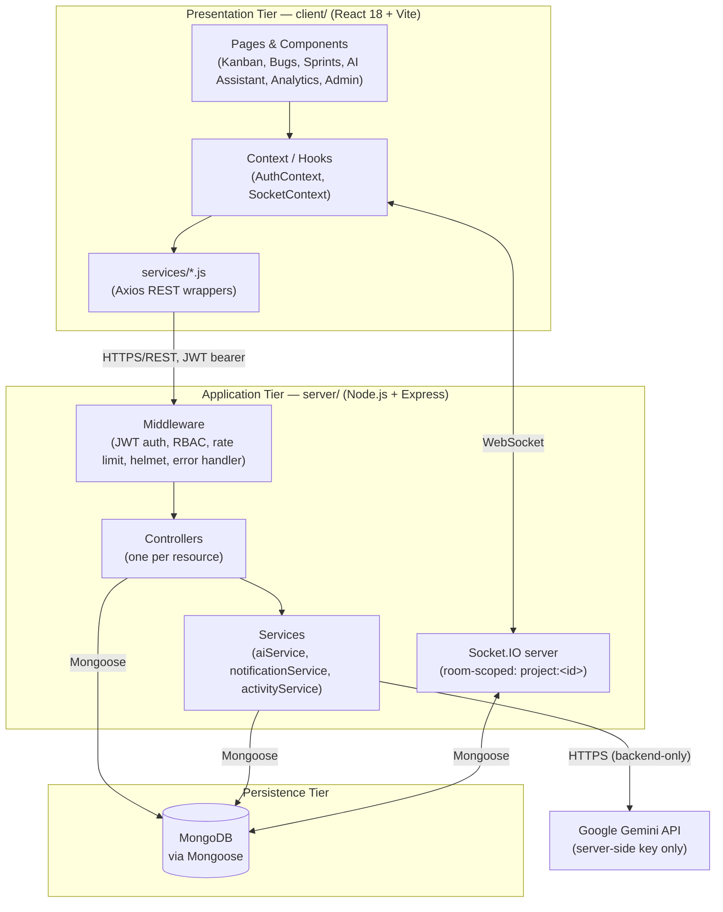

# DevPilot AI

**An Intelligent Software Project Management Platform with AI-Assisted Sprint Planning, Bug Tracking, and Team Collaboration.**

DevPilot AI combines conventional software project management — projects, sprints, Kanban tasks, bug tracking, comments, and notifications — with AI features powered by Google Gemini: sprint planning from a natural-language goal, user story generation, task prioritization, bug analysis, project risk scoring, and meeting summarization. Every AI-generated artefact is presented as an editable draft and is **never** persisted to the database without explicit human review and confirmation.

## Features

- **Auth & RBAC** — JWT authentication, bcrypt password hashing, and five roles enforced server-side on every route: Admin, Project Manager, Developer, Tester, Stakeholder.
- **Projects & Sprints** — full CRUD, member management, sprint lifecycle (Planned → Active → Completed).
- **Tasks & Kanban** — a real, working drag-and-drop board (To Do / In Progress / In Review / Done) backed by MongoDB, with priorities, due dates, story points, dependencies, and comments.
- **Bug Tracker** — severity/priority/status workflow, steps to reproduce, linked tasks, comments.
- **AI Assistant** (Gemini, backend-only key):
  - **AI Sprint Planner** — natural-language goal → structured backlog of user stories, acceptance criteria, priorities, and story points, reviewed/edited before saving.
  - **AI User Story Generator** — feature description → user story, acceptance criteria, suggested priority and tasks.
  - **AI Task Prioritization** — recommends a priority from deadline, dependencies, and sprint context.
  - **AI Bug Analyzer** — possible cause, suggested severity/module, debugging suggestions, next steps.
  - **AI Risk Analysis** — LOW/MEDIUM/HIGH project risk with an explanation, shown on the project dashboard.
  - **AI Meeting Summarizer** — meeting notes → summary, key decisions, action items (convertible into real tasks).
- **Real-time collaboration** — Socket.IO powers live task/bug board updates, comments, project chat, and notifications.
- **Analytics dashboards** — org-wide and per-project: task/bug breakdowns, team workload, sprint progress, risk.
- **Admin console** — manage users, roles, account status, and organizations.

## Tech Stack

| Layer | Technology |
|---|---|
| Frontend | React 18, Vite, Tailwind CSS, React Router, Axios, Recharts, @dnd-kit, Socket.IO client, react-hot-toast |
| Backend | Node.js, Express, MongoDB, Mongoose, Socket.IO |
| Auth | JWT (`jsonwebtoken`), `bcryptjs` |
| AI | Google Gemini (`@google/generative-ai`), isolated in a backend service layer |
| Security | `helmet`, `express-rate-limit`, CORS allow-list |

## Architecture

DevPilot AI follows the **layered (presentation / application / persistence) architecture** specified in the SRS, with AI orchestration deliberately isolated inside the application tier so provider credentials never reach the browser and every AI response is validated before it can touch project data.



**Request flow (typical CRUD):** `client/src/services/*.js` (Axios) → JWT attached from `AuthContext` → Express `protect`/`authorize` middleware validates the token and role → controller enforces resource-level access (`server/utils/accessControl.js`, always scoped to `req.user.organization` for multi-tenancy) → Mongoose model → MongoDB. Mutations that other users need to see immediately (task/bug status, comments, chat) also emit a Socket.IO event to the relevant `project:<id>` room.

**AI request flow (CON-03 / CON-04 / CON-08):** frontend calls `POST /api/v1/ai/*` with a bearer token → `aiController.js` checks role/project access → `server/services/aiService.js` builds the prompt, calls Gemini, and strictly parses/validates the JSON response → on success, the **draft** is returned to the client for human review (never auto-saved) and logged to the `AIRequest` collection for audit; on a missing key, provider outage, or malformed response, the service throws a typed `ApiError` (502/503) instead of fabricating a result, and the frontend surfaces a toast and falls back to manual entry.

- The **presentation tier** (`client/`) only renders and calls the API — it never talks to MongoDB or Gemini directly.
- The **application tier** (`server/`) owns authentication, authorization, domain logic, and all outbound AI calls.
- The **persistence tier** is MongoDB via Mongoose, with role- and organization-scoped queries enforced at the controller layer on every route.

**Deviation from the SRS deployment diagram:** the SRS specifies a containerized production topology (NGINX reverse proxy, two API replicas sharing state via Redis, a 3-member MongoDB replica set). This implementation runs as a single Express instance suitable for local/demo deployment — see [Known Limitations](#known-limitations--deviations-from-the-srs).

## Requirements

Traced from the project's SRS (Section 3, Functional Requirements; Section 5, Non-Functional Requirements). "Status" reflects what's actually implemented in this codebase, not just what was specified.

### Functional Requirements

| ID | Requirement | Actor | Status | Implementation |
|---|---|---|---|---|
| FR-01 | Register with name/email/password/organization; authenticate via JWT sessions | All users | ✅ Done | `authController.js` (`register`/`login`), `models/User.js`, `models/Organization.js`, `utils/generateToken.js` |
| FR-02 | Enforce RBAC (Manager, Developer/Tester, Administrator, Viewer) on every protected route | System | ✅ Done | `middleware/authMiddleware.js` (`protect`, `authorize`), `utils/accessControl.js`, `utils/roles.js` — checked server-side on every route, never trusted from the client |
| FR-03 | Manager creates/edits/archives projects and defines sprints with start/end dates | Manager | ✅ Done | `controllers/projectController.js`, `controllers/sprintController.js` |
| FR-04 | Manager enters a natural-language sprint goal and receives an AI-generated backlog | Manager | ✅ Done | `POST /api/v1/ai/sprint-plan` → `aiController.js` → `aiService.js` (Gemini) |
| FR-05 | Manager can edit/merge/split/delete any AI-generated story/subtask before it's committed | Manager | ✅ Done | AI output is returned as an editable draft in the UI (`AIAssistant.jsx` / sprint planner flow); nothing is written to MongoDB until the Manager explicitly saves (CON-08) |
| FR-06 | AI-assisted priority score from deadline proximity, dependencies, and velocity | System | ✅ Done | `POST /api/v1/ai/prioritize-task` — reads task deadline, dependencies, and sprint context and returns a recommended priority + rationale |
| FR-07 | Real-time Kanban board (To Do / In Progress / In Review / Done) | Dev/Tester | ✅ Done | `components/kanban/*` (`@dnd-kit`), `taskController.js`, Socket.IO broadcasts board updates to `project:<id>` rooms |
| FR-08 | Log, assign, and track bugs by severity (Low/Medium/High/Critical) and status | Dev/Tester | ✅ Done | `models/Bug.js`, `bugController.js`, `pages/projects/ProjectBugs.jsx` |
| FR-09 | Real-time chat and contextual comments via Socket.IO with notifications | All users | ✅ Done | `socket/index.js`, `components/chat/ChatPanel.jsx`, `commentController.js`, `notificationService.js` — Stakeholders are read-only per the RBAC matrix (5.2) |
| FR-10 | Summarize meeting notes into an AI-generated summary with convertible action items | All users | ✅ Done | `POST /api/v1/ai/summarize-meeting`, `meetingController.js` (`convertActionItem` turns an action item into a real `Task`) |
| FR-11 | Analytics dashboard with velocity, bug trends, and an AI risk score | Manager, Viewer | ✅ Done | `analyticsController.js`, `pages/Dashboard.jsx` / `ProjectAnalytics.jsx` (Recharts), `POST /api/v1/ai/analyze-risk` |
| FR-12 | Administrator manages user accounts, roles, and the configured AI provider API key | Administrator | ⚠️ Partial | `pages/Admin.jsx` + `userController.js` cover account/role/status management. The AI provider key is configured via `server/.env` (`GEMINI_API_KEY`), **not** an in-app admin UI — deliberately, so the key is never transmitted through the browser at all |

### Non-Functional Requirements

**Performance (SRS §5.1)** — targets apply under normal load and exclude the external AI provider's own response time. These are the design targets; no formal load-testing pass has been run against them yet.

| ID | Operation | Target |
|---|---|---|
| NFR-01 | Standard CRUD (task/bug/project update) | Under 1s, excluding network latency |
| NFR-02 | AI sprint plan generation | Under 15s, excluding provider response time |
| NFR-03 | AI task prioritization pass | Under 10s for up to 200 backlog items |
| NFR-04 | Meeting summarization | Under 12s for input up to 10,000 characters |
| NFR-05 | Real-time chat and board update delivery | Under 2s to all connected clients |
| NFR-06 | Concurrent users per deployment instance | At least 200 |

**Security (SRS §5.2):**

- JWTs (RFC 7519), passwords hashed with `bcryptjs`. **Deviation:** the SRS specifies 15-minute access tokens with 7-day rotating refresh tokens; this implementation uses a single 7-day JWT for simplicity (see [Known Limitations](#known-limitations--deviations-from-the-srs)).
- RBAC enforced **server-side on every protected route**, never in the UI alone — the UI hides/disables actions a role can't take, but the API independently re-checks and rejects them.
- The SRS's resource/action × role matrix is enforced as follows, all server-verified:

  | Resource / Action | Manager | Dev/Tester | Admin | Viewer |
  |---|---|---|---|---|
  | Create/archive project, define sprint | Allow | Deny | Allow | Deny |
  | Invoke AI planning & prioritization | Allow | Deny | Allow | Deny |
  | Update task status on board | Allow | Allow (assigned) | Allow | Deny |
  | Log, assign, resolve bugs | Allow | Allow | Allow | Deny |
  | Post chat messages & comments | Allow | Allow | Allow | Deny |
  | View analytics and risk score | Allow | Allow | Allow | Allow |
  | Manage users, roles, AI provider key | Deny | Deny | Allow | Deny |

**Software Quality Attributes (SRS §5.3):**

| Attribute | Target | Notes |
|---|---|---|
| Reliability | 99.5% monthly uptime; a failed AI request never loses user input | AI failures throw a clean `ApiError` (502/503) rather than corrupting state; any text the user typed stays in the form |
| Maintainability | Prompt/scoring logic isolated from CRUD logic; ≥80% unit test coverage | Isolation achieved (`server/services/aiService.js` is the only file that talks to Gemini). **No automated test suite exists yet** — see [Future Enhancements](#future-enhancements) |
| Scalability | Horizontal scaling from <10 to 1,000+ users | Not yet implemented — current deployment is a single stateless-ish Express instance; horizontal scaling needs the Redis Socket.IO adapter noted below |
| Usability | A first-time Manager can create a project and generate an AI plan within 10 minutes | Achieved in practice via the seeded demo project and the guided AI Sprint Planner flow |

## Folder Structure

```
DevPilot-AI/
├── client/                # React + Vite frontend
│   └── src/
│       ├── components/    # layout, common UI, kanban, tasks, bugs
│       ├── context/       # AuthContext, SocketContext
│       ├── hooks/         # useAuth, useSocket
│       ├── pages/         # route-level pages (auth, projects, tasks, bugs, ...)
│       ├── services/      # one file per REST resource (axios wrappers)
│       └── utils/         # roles, constants, formatting
├── server/                # Express backend
│   ├── config/            # db.js
│   ├── controllers/       # one per resource
│   ├── middleware/        # auth, error handling
│   ├── models/            # Mongoose schemas
│   ├── routes/            # one per resource, nested where relevant
│   ├── services/          # aiService, notificationService, activityService
│   ├── socket/            # Socket.IO server + auth
│   ├── seed/               # demo data seed script
│   └── server.js
├── .gitignore
└── README.md
```

## Getting Started

### Prerequisites

- Node.js 18+
- A MongoDB instance — [MongoDB Atlas](https://www.mongodb.com/atlas) (free tier) or a local `mongod`
- (Optional but required for AI features) A [Google Gemini API key](https://ai.google.dev/)

### 1. Install dependencies

```bash
cd server && npm install
cd ../client && npm install
```

### 2. Configure environment variables

Create a `server/.env` and a `client/.env` file (both are git-ignored — never commit them). The backend needs its port, database connection string, JWT secret/expiry, allowed client origin, and your Gemini API key/model; the frontend needs the backend API URL and Socket.IO URL. See `server/config/db.js`, `server/server.js`, and `client/src/services/api.js` for the exact variable names each reads.

### 3. Seed demo data (recommended)

Populates a demo organization, one account per role, and a full "E-Commerce Platform" project with sprints, tasks across every Kanban column, bugs, comments, and notifications:

```bash
cd server
npm run seed
```

### 4. Run the app

```bash
# terminal 1
cd server && npm run dev

# terminal 2
cd client && npm run dev
```

Open `http://localhost:5173`.

## Demo Credentials

*(created by `npm run seed` — development/demo accounts only, not real secrets)*

| Role | Email | Password |
|---|---|---|
| Admin | `admin@devpilot.ai` | `DevPilot@Demo123` |
| Project Manager | `pm@devpilot.ai` | `DevPilot@Demo123` |
| Developer | `dev1@devpilot.ai` | `DevPilot@Demo123` |
| Developer | `dev2@devpilot.ai` | `DevPilot@Demo123` |
| Tester | `tester@devpilot.ai` | `DevPilot@Demo123` |
| Stakeholder | `stakeholder@devpilot.ai` | `DevPilot@Demo123` |

## AI Setup

1. Get a key from [Google AI Studio](https://aistudio.google.com/app/apikey).
2. Put it in `server/.env` as `GEMINI_API_KEY` — **backend only**, it is never sent to or embedded in the frontend bundle.
3. If the key is missing or the provider errors, AI endpoints return `503`/`502` with a clear message and the frontend surfaces it as a toast — no feature fakes a response.

## API Overview

All routes are versioned under `/api/v1`. Every route requires `Authorization: Bearer <token>` except `/auth/register` and `/auth/login`.

```
POST   /api/v1/auth/register
POST   /api/v1/auth/login
GET    /api/v1/auth/me
PUT    /api/v1/auth/profile
PUT    /api/v1/auth/change-password

GET    /api/v1/users
PUT    /api/v1/users/:id/role          (Admin)
PUT    /api/v1/users/:id/status        (Admin)

GET    /api/v1/organizations           (Admin)

GET    /api/v1/projects
POST   /api/v1/projects                (Manager/Admin)
GET    /api/v1/projects/:id
PUT    /api/v1/projects/:id            (Manager/Admin)
POST   /api/v1/projects/:id/members    (Manager/Admin)

GET    /api/v1/projects/:projectId/sprints
POST   /api/v1/projects/:projectId/sprints        (Manager/Admin)

GET    /api/v1/tasks                   (cross-project, current user)
GET    /api/v1/projects/:projectId/tasks
POST   /api/v1/projects/:projectId/tasks           (Manager/Admin)
PUT    /api/v1/tasks/:id               (assignee can change status; Manager/Admin can edit everything)

GET    /api/v1/bugs
GET/POST /api/v1/projects/:projectId/bugs
PUT    /api/v1/bugs/:id

POST   /api/v1/tasks/:id/comments · /api/v1/bugs/:id/comments

GET    /api/v1/notifications
PUT    /api/v1/notifications/:id/read

GET    /api/v1/analytics/overview
GET    /api/v1/projects/:projectId/analytics

POST   /api/v1/ai/sprint-plan          (Manager/Admin)
POST   /api/v1/ai/user-story           (Manager/Admin)
POST   /api/v1/ai/prioritize-task      (Manager/Admin)
POST   /api/v1/ai/analyze-bug
POST   /api/v1/ai/analyze-risk         (Manager/Admin)
POST   /api/v1/ai/summarize-meeting

GET/POST /api/v1/projects/:projectId/meetings
```

## Known Limitations / Deviations from the SRS

- **Access tokens**: the SRS specifies short-lived (15 min) access tokens with 7-day rotating refresh tokens. This implementation uses a single 7-day JWT for simplicity — acceptable for an academic/demo deployment, but should be hardened with refresh-token rotation before any real production use.
- **File attachments** on bugs are modelled (`url`/`name`) but there is no file upload endpoint yet — attachments would need to be uploaded to object storage (e.g. S3) and the URL saved.
- **Redis-backed Socket.IO scaling** (for horizontal replicas, per the SRS deployment diagram) is not implemented — a single instance is assumed.

## Future Enhancements

- Refresh-token rotation and session revocation
- File/attachment uploads for bugs and tasks
- Subtask hierarchy (currently AI-generated stories map to a single task with acceptance criteria + a suggested-subtasks list in the description)
- Redis adapter for Socket.IO to support multiple API replicas
- Automated test suite (Jest/Vitest + Supertest) — the architecture (services/controllers separated from routes) is designed to make this straightforward to add
